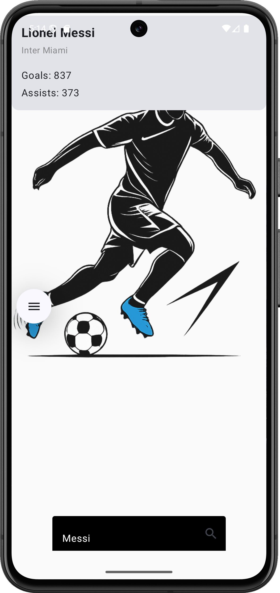

# ⚽ FootballHUB

> **A Native Android Application for Real-Time Football Statistics and Player Analysis.**

---

## 📱 Overview
**FootballHUB** is a modern, native Android application built entirely in **Kotlin**. It serves as a comprehensive database for football enthusiasts, offering a sleek interface to search for players and view critical career statistics instantly.

Unlike generic sports apps, FootballHUB focuses on a **clean, vector-art inspired UI**, featuring custom-designed assets, gradient aesthetics, and a seamless user experience from splash screen to search results.

## 🌟 Key Features
* **🚀 Instant Player Search:** Robust search algorithm to query player databases instantly.
* **📊 Detailed Statistics:** Displays comprehensive metrics including **Goals, Assists, Current Club, and Age**.
* **🎨 Custom UI/UX:**
    * Hand-crafted **Splash Screen** featuring dynamic player imagery.
    * **Gradient Backgrounds** and custom vector assets for a premium feel.
    * Dark/Light mode optimized visual hierarchy.
* **✨ Custom Branding:** Unique App Icon and Logo designed specifically for this project.

## 🛠️ Tech Stack
* **Language:** Kotlin (100%)
* **UI Toolkit:** Android XML / Material Design
* **Architecture:** MVVM (Model-View-ViewModel) pattern
* **IDE:** Android Studio Hedgehog/Iguana

## 📸 App Interface

| **Splash Screen** | **Welcome Screen** | **Home / Search** | **Player Stats** |
|:---:|:---:|:---:|:---:|
|  |  |  |  |

> *The interface features a custom vector-based design language, ensuring high readability and visual appeal.*

## ⚡ Getting Started

### Prerequisites
* Android Studio (Latest Version recommended)
* JDK 11 or higher
* Android Device or Emulator (API Level 26+)

### Installation
1.  **Clone the Repository**
    ```bash
    git clone [https://github.com/Rowdrick05/FootballHUB.git](https://github.com/Rowdrick05/FootballHUB.git)
    ```
2.  **Open in Android Studio**
    * File -> Open -> Select the `FootballHUB` folder.
3.  **Sync Gradle**
    * Allow Android Studio to download necessary dependencies.
4.  **Run the App**
    * Connect your device via USB or launch an Emulator.
    * Click the green **Run** (▶) button.

## 👨‍💻 Author
**Rowdrick**
* **Role:** Android Developer & UI Designer
* **Focus:** Building scalable, user-centric mobile applications.

---
*Built with ❤️ and Kotlin.*
