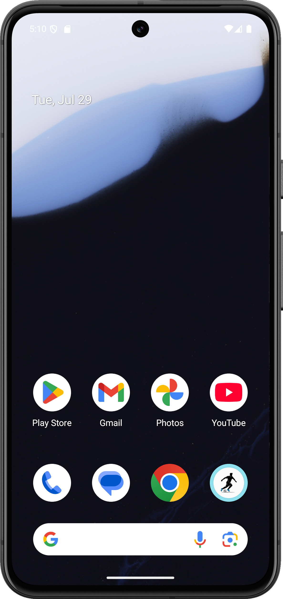
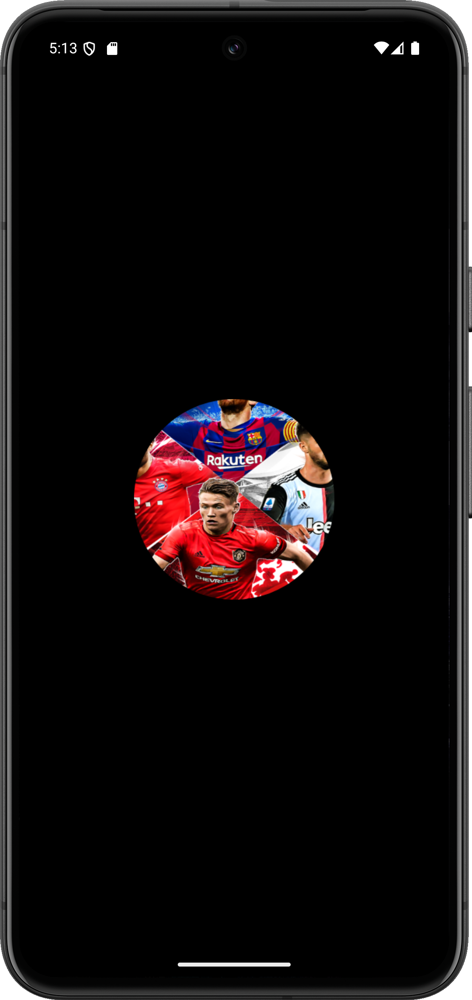
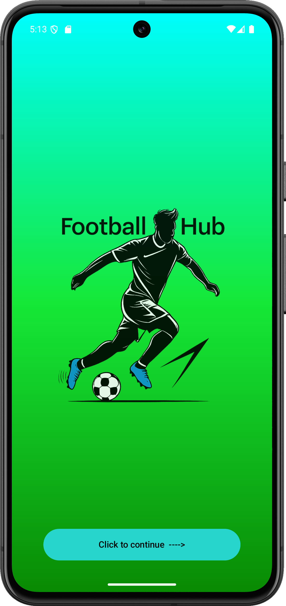
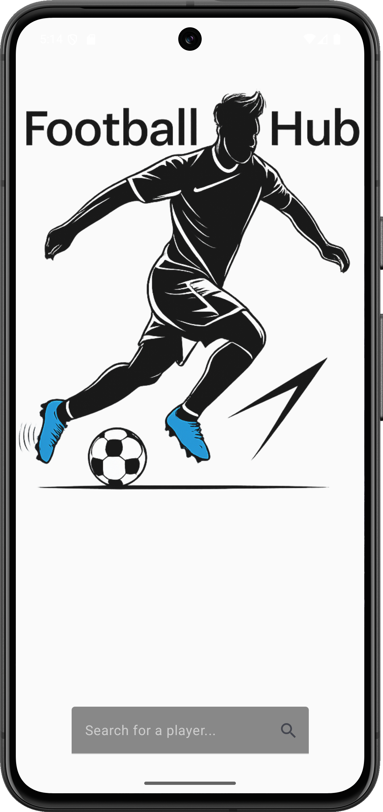
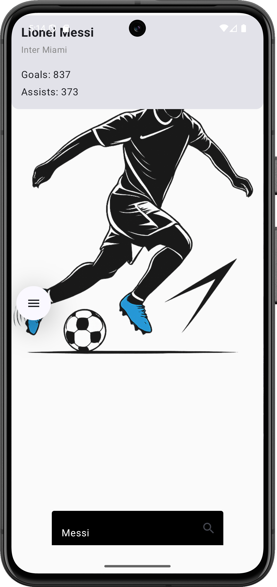

# Football HUB ⚽

A modern Android application built entirely with Jetpack Compose that allows users to search for football players and view their statistics. This project demonstrates key modern Android development skills, including UI, state management, and navigation.

## Demo 🎥

## Screenshots

## Features

- **Modern Splash Screen:** Utilizes the official `SplashScreen` API for a professional launch experience.
- **Multi-Screen Navigation:** Uses Navigation Compose to move between different screens.
- **Interactive Search:** Features a live search bar to filter a list of players.
- **Dynamic UI:** The user interface is built entirely with Jetpack Compose.
- **Clean Architecture:** Uses a `ViewModel` to manage state and business logic.

## Tech Stack

- **Language:** Kotlin
- **UI:** Jetpack Compose
- **State Management:** ViewModel & StateFlow
- **Navigation:** Navigation Compose
- **Asynchronous:** Kotlin Coroutines

## Future Improvements

- [ ] Integrate a real-time Sports API with Retrofit.
- [ ] Add a player detail screen.
- [ ] Implement a local database with Room to save favorite players.
